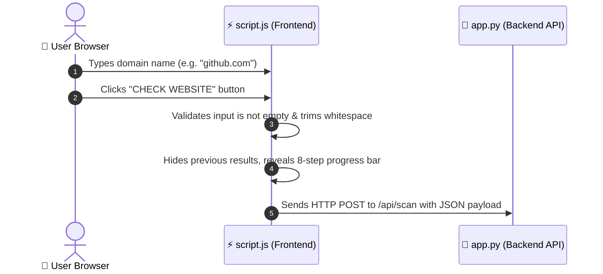
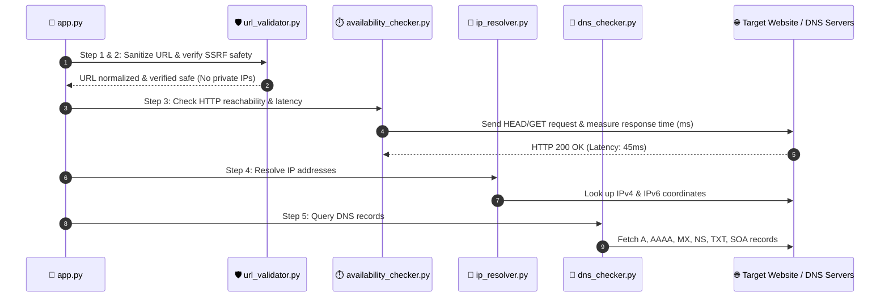
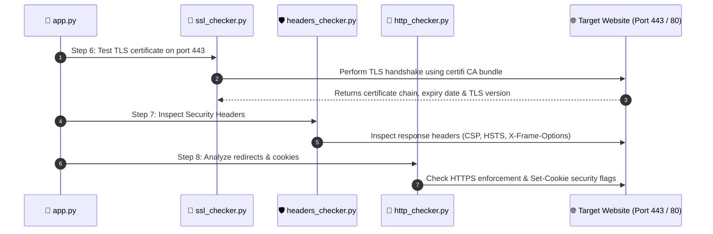
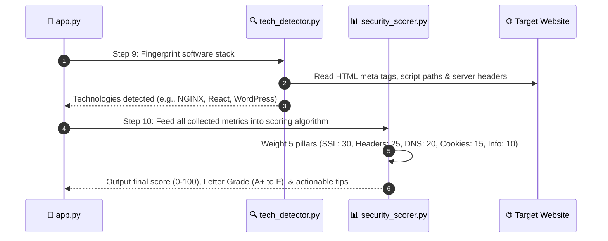
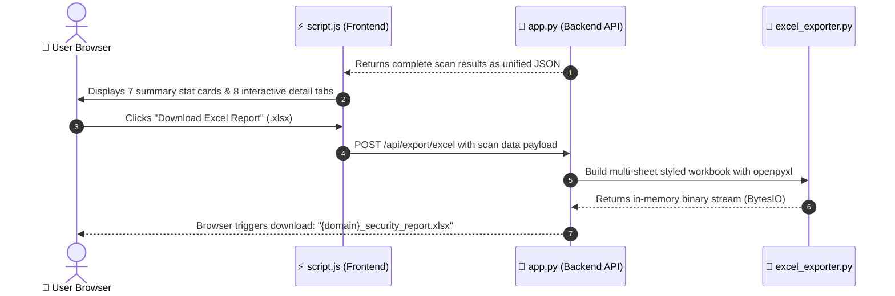

# 📘 The Website Information & Security Checker: An End-to-End Explainer Notebook

Welcome! If you have ever wondered what actually happens when you type `https://google.com` into your browser, how hackers probe websites for weaknesses, or how a cybersecurity audit works, this notebook is written specifically for you.

We will break down every single component, file, algorithm, and technical concept in this project using **plain English**, **real-world analogies**, and **concrete examples**. No prior cybersecurity degree required!

---

## 📑 Table of Contents

1. [The Big Picture: What Does This Project Do?](#1-the-big-picture-what-does-this-project-do)
2. [Passive Reconnaissance vs. Active Attacks](#2-passive-reconnaissance-vs-active-attacks)
3. [The Complete Life Cycle of a Scan](#3-the-complete-life-cycle-of-a-scan)
   - [The Master Architecture Sequence Diagram](#the-master-architecture-sequence-diagram)
   - [Part 1: User Request & Frontend Trigger](#part-1-user-request--frontend-trigger)
   - [Part 2: Security Gatekeeper & Network Discovery](#part-2-security-gatekeeper--network-discovery)
   - [Part 3: Cryptography & Security Shield Auditing](#part-3-cryptography--security-shield-auditing)
   - [Part 4: Technology Fingerprinting & Security Scoring](#part-4-technology-fingerprinting--security-scoring)
   - [Part 5: Results Presentation & Excel Audit Export](#part-5-results-presentation--excel-audit-export)
4. [Deep Dive into Every Module & Technical Concept](#4-deep-dive-into-every-module--technical-concept)
   - [Module 1: URL Validation & Cleaning](#module-1-url-validation--cleaning-url_validatorpy)
   - [Module 2: SSRF Defense (The "Trojan Horse" Shield)](#module-2-ssrf-defense-url_validatorpy)
   - [Module 3: Availability & Response Latency](#module-3-availability--response-latency-availability_checkerpy)
   - [Module 4: IP Address Resolution (The Internet's Street Address)](#module-4-ip-address-resolution-ip_resolverpy)
   - [Module 5: DNS Records (The Internet's Phonebook)](#module-5-dns-records-dns_checkerpy)
   - [Module 6: SSL/TLS Certificates (The Digital Passport & Armored Truck)](#module-6-ssltls-certificates-ssl_checkerpy)
   - [Module 7: HTTP Analysis, Redirects & Cookies](#module-7-http-analysis-redirects--cookies-http_checkerpy)
   - [Module 8: Security Headers (The Security Guards at the Gate)](#module-8-security-headers-headers_checkerpy)
   - [Module 9: Technology Stack Detection (Passive Fingerprinting)](#module-9-technology-stack-detection-tech_detectorpy)
   - [Module 10: The Security Scoring Engine](#module-10-the-security-scoring-engine-security_scorerpy)
   - [Module 11: Excel Audit Report Generator](#module-11-excel-audit-report-generator-excel_exporterpy)
5. [The Frontend Experience: How the User Interface Works](#5-the-frontend-experience-how-the-user-interface-works)
6. [Why We Switched from Port 5000 to Port 5001](#6-why-we-switched-from-port-5000-to-port-5001)
7. [Glossary of Key Technical Terms](#7-glossary-of-key-technical-terms)

---

## 1. The Big Picture: What Does This Project Do?

### 🚗 The Car Inspection Analogy
Imagine taking your car to a mechanic for a safety checkup. The mechanic doesn't crash your car into a wall to see if the airbags work. Instead, they check:
- Are the brake pads worn down?
- Are the headlights bright?
- Is the seatbelt locked properly?
- Is the vehicle registration up to date?

**The Website Information & Security Checker does the exact same thing for any website on the internet.**

When you give it a website address (like `https://example.com`), it performs a comprehensive, non-destructive health checkup. It inspects whether the website uses encryption, whether its digital identity certificate is valid, whether it has set up security headers to protect visitors, and calculates an overall **Security Score from 0 to 100 with a Letter Grade (A+ down to F)**.

---

## 2. Passive Reconnaissance vs. Active Attacks

In cybersecurity, there are two ways to analyze a target:

| Concept | What It Means | Real-Life Analogy | Is It Legal? |
| :--- | :--- | :--- | :--- |
| **Passive Reconnaissance** (What our tool does) | Gathering information that is already broadcasted to the public without attempting to break in or exploit anything. | Standing on the public sidewalk looking at a building: checking if the front door has a lock, noting the brand of the security cameras, and checking the building's directory. | **100% Legal & Safe.** |
| **Active Penetration Testing / Attacking** | Sending malicious inputs, attempting password brute-forcing, exploiting vulnerabilities, or trying to crash the system. | Throwing rocks at windows, picking the door lock, or trying master keys. | **Illegal without explicit written permission.** |

Our application is purely **passive and non-destructive**. It only reads public records and public HTTP responses.

---

## 3. The Complete Life Cycle of a Scan

To understand how our tool works, we look at it from two perspectives:
1. **The Master Architecture Sequence Diagram** (The complete bird's-eye view of all interactions)
2. **Segregated Phases with Focused Diagrams** (Breaking the big sequence diagram down into 5 bite-sized, easy-to-digest stages with in-depth explanations and analogies)

---

### The Master Architecture Sequence Diagram

Here is the complete journey of a request from the exact second you click the **"CHECK WEBSITE"** button:

```mermaid
sequenceDiagram
    autonumber
    actor User as 👤 User Browser
    participant JS as ⚡ script.js (Frontend)
    participant Flask as 🐍 app.py (Flask API)
    participant Modules as 🔍 Scan Modules
    participant Target as 🌐 Target Website

    User->>JS: Enters URL & clicks "CHECK WEBSITE"
    JS->>JS: Validates format & displays animated loading steps
    JS->>Flask: POST /api/scan { url: "https://example.com" }
    
    rect rgb(30, 41, 59)
    note over Flask,Modules: Backend Security Inspection Pipeline
    Flask->>Modules: Step 1 & 2: Validate URL syntax & check SSRF safety
    Flask->>Target: Step 3: Check HTTP Reachability & measure latency
    Flask->>Target: Step 4: Resolve IPv4 and IPv6 addresses via DNS
    Flask->>Target: Step 5: Query DNS records (A, AAAA, MX, NS, TXT, SOA)
    Flask->>Target: Step 6: Test HTTPS availability, redirects & cookies
    Flask->>Target: Step 7: Open TLS socket handshake & verify certificate
    Flask->>Target: Step 8: Inspect Security Headers & information leaks
    Flask->>Target: Step 9: Detect CMS, web servers, and JS libraries
    Flask->>Modules: Step 10: Calculate 100-point security score & grade
    end
    
    Flask-->>JS: Returns complete JSON results
    JS->>User: Renders 7 summary cards & 8 interactive detail tabs
    User->>JS: Clicks "Download Excel"
    JS->>Flask: POST /api/export/excel (with scan data)
    Flask-->>User: Downloads styled .xlsx multi-sheet workbook
```



---

### Breaking Down the Master Diagram into 5 Simple Phases

Because the master sequence diagram involves multiple components working together, we break it down into **5 clear, segregated sections**. Each section has its own focused mini-diagram and step-by-step explanation.

---

### Part 1: User Request & Frontend Trigger

Before the Python backend does any work, the browser handles the initial user interaction, inputs, and visual states.



#### 🔍 What is happening here?
1. **User Input:** You enter a website address in the input field and press Enter or click the primary button.
2. **Client-Side Polish:** [`static/js/script.js`](file:///Users/lakkakulasaiakash/Documents/website_checker/static/js/script.js) checks if the box is empty. If empty, it alerts you immediately without wasting time contacting the server.
3. **Animated Feedback:** The previous scan results are tucked away, and an 8-stage progress tracker lights up sequentially so you know work is happening.
4. **The Hand-off:** JavaScript issues an asynchronous `fetch('/api/scan', { method: 'POST', body: ... })` call to hand the target URL to Python.

> **💡 Real-Life Analogy: The Front Reception Desk**  
> You walk into a medical clinic, fill out your name on the clipboard, and hand it to the receptionist. The receptionist checks that you signed the form and hands your file to the doctor in the back office.

---

### Part 2: Security Gatekeeper & Network Discovery

Now the request is inside our Python server. Before performing any security tests, Python must ensure the URL is safe to scan and find its physical location on the internet.



#### 🔍 What is happening here?
1. **SSRF Gatekeeper:** [`modules/url_validator.py`](file:///Users/lakkakulasaiakash/Documents/website_checker/modules/url_validator.py) inspects the domain to prevent **Server-Side Request Forgery (SSRF)**. If someone asks the scanner to attack internal addresses like `localhost`, `127.0.0.1`, or `169.254.169.254` (cloud metadata), the scanner stops immediately with a safety rejection.
2. **Doorbell Ping:** [`modules/availability_checker.py`](file:///Users/lakkakulasaiakash/Documents/website_checker/modules/availability_checker.py) sends a fast test ping to check if the website is online and times the millisecond latency.
3. **Street Addresses:** [`modules/ip_resolver.py`](file:///Users/lakkakulasaiakash/Documents/website_checker/modules/ip_resolver.py) uses Python's network sockets to discover the server's public IPv4 and IPv6 addresses.
4. **Global Phonebook:** [`modules/dns_checker.py`](file:///Users/lakkakulasaiakash/Documents/website_checker/modules/dns_checker.py) queries the world's domain name system for mail exchangers (`MX`), authoritative nameservers (`NS`), and authentication keys (`TXT`/`SPF`).

> **💡 Real-Life Analogy: The Building Bouncer & GPS Lookup**  
> The bouncer checks your ID to make sure you aren't trying to break into the staff breakroom. Once cleared, you look up the venue's GPS coordinates and check their directory listing to find the delivery dock.

---

### Part 3: Cryptography & Security Shield Auditing

With the network coordinates verified, the scanner inspects the website's digital identity and the defensive shields guarding its visitors.



#### 🔍 What is happening here?
1. **SSL/TLS Handshake:** [`modules/ssl_checker.py`](file:///Users/lakkakulasaiakash/Documents/website_checker/modules/ssl_checker.py) opens a secure socket to port 443 using trusted root certificate authorities (`certifi`). It validates:
   - Certificate Issuer (e.g., Let's Encrypt, DigiCert, Cloudflare).
   - Remaining days before expiration.
   - Whether the domain matches the Subject Alternative Names (SANs).
   - The cipher strength and TLS protocol version (TLS 1.2 vs TLS 1.3).
2. **Security Headers Inspection:** [`modules/headers_checker.py`](file:///Users/lakkakulasaiakash/Documents/website_checker/modules/headers_checker.py) checks if the server sends essential browser protection rules (`Content-Security-Policy`, `Strict-Transport-Security`, `X-Frame-Options`, `X-Content-Type-Options`, `Referrer-Policy`, `Permissions-Policy`).
3. **Cookie Safety:** [`modules/http_checker.py`](file:///Users/lakkakulasaiakash/Documents/website_checker/modules/http_checker.py) verifies whether cookies carry `Secure`, `HttpOnly`, and `SameSite` flags to prevent session hijacking.

> **💡 Real-Life Analogy: The Passport Check & Bank Armor**  
> An airport official inspects the holographic stamp on a passport to verify identity. Meanwhile, a bank safety inspector tests whether teller windows have bulletproof glass and surveillance cameras.

---

### Part 4: Technology Fingerprinting & Security Scoring

Now that raw data has been gathered, the scanner identifies what software the website uses and calculates an objective security grade.



#### 🔍 What is happening here?
1. **Passive Fingerprinting:** [`modules/tech_detector.py`](file:///Users/lakkakulasaiakash/Documents/website_checker/modules/tech_detector.py) analyzes public HTML tags, JavaScript filenames, and HTTP header signatures. It detects CMS platforms (WordPress, Shopify), web servers (NGINX, Apache), CDNs (Cloudflare), and frontend libraries (React, jQuery).
2. **The 100-Point Scoring Algorithm:** [`modules/security_scorer.py`](file:///Users/lakkakulasaiakash/Documents/website_checker/modules/security_scorer.py) aggregates all metrics into a transparent, weighted formula:
   - **SSL/TLS (30 pts):** Valid certificate, modern TLS 1.3, days until expiry.
   - **Security Headers (25 pts):** Crucial headers like CSP, HSTS, and XFO present.
   - **DNS Health (20 pts):** Proper nameservers, MX records, SPF authorization.
   - **Cookie Security (15 pts):** Strict `HttpOnly` and `Secure` attributes.
   - **Info Leak Prevention (10 pts):** Server headers that hide internal version numbers.
3. **Letter Grade Assignment:** Converts points into a human-readable grade (`A+`, `A`, `B`, `C`, `D`, or `F`) and generates specific recommendations for any detected weaknesses.

> **💡 Real-Life Analogy: The Teacher's Report Card**  
> The teacher grades each section of a final exam (Math: 30%, Science: 25%, History: 20%, etc.), tallies the score, and stamps an official letter grade with notes on where to study harder.

---

### Part 5: Results Presentation & Excel Audit Export

In the final phase, the results are sent back to the user's browser, rendered interactively, and made available for instant spreadsheet export.



#### 🔍 What is happening here?
1. **JSON Payload Delivery:** Flask returns the comprehensive dictionary of all findings in a single clean JSON response.
2. **Interactive UI Rendering:** [`static/js/script.js`](file:///Users/lakkakulasaiakash/Documents/website_checker/static/js/script.js) populates 7 top-level summary cards (Grade, Score, Latency, IP, SSL Expiry, Headers passed, Server) and 8 interactive detail tabs with search bars and badges.
3. **One-Click Excel Generation:** When you click **"Download Excel Report"**, [`modules/excel_exporter.py`](file:///Users/lakkakulasaiakash/Documents/website_checker/modules/excel_exporter.py) uses `openpyxl` to build an 8-sheet spreadsheet complete with:
   - Executive Summary sheet with key metrics.
   - 7 detailed category sheets.
   - Color-coded status fills (Green for Pass, Red for Fail, Amber for Warning).
   - Auto-fitted column widths for easy reading.
4. **Direct Browser Download:** The server transmits the file directly into your browser's Downloads folder without needing temporary files saved on disk.

> **💡 Real-Life Analogy: The Diagnostic Folder**  
> The mechanic walks out to the waiting room, displays the test results on a screen, and hands you a printed, laminated multi-page booklet of your car's inspection to keep in your glovebox.

---

## 4. Deep Dive into Every Module & Technical Concept

Let's open the hood and explore each module in the `modules/` folder.

---

### Module 1: URL Validation & Cleaning (`url_validator.py`)

#### 🎯 What is it?
Before you do anything with user input, you must ensure it is safe, sane, and standard. People type URLs in all kinds of formats:
- `example.com`
- `http://example.com`
- `https://EXAMPLE.COM/`
- `javascript:alert(1)` ⚠️ *(Dangerous!)*

#### 💡 Beginner Analogy: The Post Office Address Standardizer
If someone writes *"NY, Empire State Bldg"*, the postal system reformats it to:
`350 5th Ave, New York, NY 10118`.
Our validator normalizes URLs so the rest of the application never crashes on unexpected formats.

#### 🛠️ What it does under the hood:
1. **Blocks dangerous protocols**: Reject schemes like `javascript:`, `file:`, `data:`, `ftp:`.
2. **Auto-fixes missing scheme**: If the user enters `github.com`, it automatically turns it into `https://github.com`.
3. **Splits components**: Extracts the hostname (`github.com`), scheme (`https`), port (`443`), and path (`/`).

---

### Module 2: SSRF Defense (`url_validator.py`)

#### 🎯 Technical Term: SSRF (Server-Side Request Forgery)
> **Definition**: A security vulnerability where an attacker tricks a web server into making network requests to internal, private resources that are not meant to be accessible from the public internet.

#### 💡 The "Trojan Horse Delivery Guy" Analogy
Imagine you run a package delivery service. A customer asks your delivery driver:
*"Please take this envelope and deliver it to Room 102 inside your own corporate headquarters, where your financial vault is."*
If the driver blindly obeys, they just bypassed the building's exterior security guards because the request came from **inside the building**!

In web applications, if our server allows users to scan `http://127.0.0.1` (the server itself) or `http://169.254.169.254` (the cloud provider's internal metadata service containing secret API keys), an attacker could steal cloud credentials!

#### 🛡️ How Our SSRF Defense Works:
Before scanning any domain, we resolve its hostname to an IP address and verify it is **not**:
1. **Loopback**: `127.0.0.1` (localhost / the server itself).
2. **Private LAN Networks**:
   - `10.0.0.0` – `10.255.255.255` (Class A private)
   - `172.16.0.0` – `172.31.255.255` (Class B private)
   - `192.168.0.0` – `192.168.255.255` (Class C home/office routers)
3. **Cloud Metadata Endpoints**: `169.254.169.254` (AWS/GCP/Azure internal secret vault).

If any of these are detected, the request is immediately blocked with a **403 Forbidden** error.

---

### Module 3: Availability & Response Latency (`availability_checker.py`)

#### 🎯 What is it?
It checks: **"Is the website actually online right now, and how fast did it answer?"**

#### 💡 Beginner Analogy: The Doorbell Test
You walk up to a house and ring the doorbell.
- If someone opens the door in 0.2 seconds → **Online (Fast)**.
- If it takes 5 seconds → **Online (Slow)**.
- If no one ever answers or the house doesn't exist → **Offline**.

#### 🛠️ What it measures:
- **HTTP Status Code**:
  - `200 OK`: Everything is working normally.
  - `301 / 302`: Redirected to another location.
  - `404 Not Found`: Page does not exist.
  - `500 Internal Server Error`: The target server crashed.
- **Latency / Response Time**:
  - `Fast`: Under 500 ms (Green badge).
  - `Moderate`: 500 ms – 1000 ms (Yellow badge).
  - `Slow`: Over 1000 ms (Red badge).

---

### Module 4: IP Address Resolution (`ip_resolver.py`)

#### 🎯 What is an IP Address?
Computers do not understand human words like `netflix.com`. They communicate using numbers called **IP (Internet Protocol) Addresses**.

#### 💡 Beginner Analogy: Street Coordinates
`netflix.com` is like saying *"The White House"*.
The IP address `198.51.100.1` is like the exact GPS coordinates: `38.8977° N, 77.0365° W`.

#### 🌐 IPv4 vs. IPv6:
- **IPv4** (Old Standard): Looks like `142.250.190.46`. Uses 32 bits, allowing ~4.3 billion addresses. Because the world ran out of IPv4 addresses, IPv6 was created.
- **IPv6** (Modern Standard): Looks like `2607:f8b0:4005:805::200e`. Uses 128 bits, providing virtually unlimited addresses.

Our module queries both IPv4 and IPv6 addresses so you see the complete network infrastructure.

---

### Module 5: DNS Records (`dns_checker.py`)

#### 🎯 Technical Term: DNS (Domain Name System)
> **Definition**: The global, decentralized phonebook of the internet that translates human-friendly domain names into IP addresses and routes email and service traffic.

Our tool queries 7 essential DNS record types:

```
                  ┌────────────── DNS PHONEBOOK ──────────────┐
                  │                                           │
  example.com ───►│  A Record     ──► 93.184.216.34 (IPv4)     │
                  │  AAAA Record  ──► 2606:2800:220:1:: (IPv6) │
                  │  MX Record    ──► mail.example.com (Email)│
                  │  NS Record    ──► ns1.cloudflare.com (DNS) │
                  │  CNAME Record ──► alias to primary name   │
                  │  TXT Record   ──► v=spf1 ... (Anti-Spam)  │
                  │  SOA Record   ──► Authority & Serial #    │
                  └───────────────────────────────────────────┘
```

#### Detailed Breakdown of Records:
1. **A Record (Address)**: Points the domain to an IPv4 address.
2. **AAAA Record ("Quad-A")**: Points the domain to an IPv6 address.
3. **MX Record (Mail Exchange)**: Specifies which mail server handles email sent to `@domain.com`. Each has a priority number (lower number = higher priority).
4. **NS Record (Name Server)**: Specifies which company hosts the DNS records (e.g., Cloudflare, AWS Route 53, GoDaddy).
5. **CNAME Record (Canonical Name)**: An alias. For example, pointing `blog.mysite.com` to `mysite.wordpress.com`.
6. **TXT Record (Text)**: Human-readable text attached to a domain. Heavily used for **SPF (Sender Policy Framework)** to prove that an email really came from your company and not a scammer spoofing your name!
7. **SOA Record (Start of Authority)**: Contains administrative metadata, including the primary name server, administrator email, and how often secondary servers should refresh their cache.

---

### Module 6: SSL/TLS Certificates (`ssl_checker.py`)

#### 🎯 What is SSL / TLS?
- **SSL** (Secure Sockets Layer): The old encryption technology (invented in 1995, now retired).
- **TLS** (Transport Layer Security): The modern, secure replacement (TLS 1.2 and TLS 1.3). People still colloquially say "SSL", but today everyone actually uses TLS.

#### 💡 The "Armored Truck & ID Badge" Analogy
When you browse via plain `http://`:
- Everything you send (passwords, credit cards) is written on a **clear postcard**. Anyone sitting on the same coffee shop Wi-Fi can read it.
When you browse via `https://`:
- Your data is locked in a **tamper-proof armored truck** (Encryption).
- The website presents a **notarized government passport** signed by a trusted authority proving it is really who it claims to be (Authentication).

#### 🔍 What Our SSL Checker Inspects:
1. **Validity**: Has the certificate been signed by a trusted **Certificate Authority (CA)** (e.g., Let's Encrypt, DigiCert, Google Trust Services)?
2. **Hostname Match**: Does the name on the certificate match the domain you typed? If you visit `bank.com` and the certificate says `fake-site.com`, that's a red flag!
3. **Expiration Countdown**: Certificates are only valid for 90 to 365 days. If a certificate expires, all major web browsers will block the site with a terrifying red warning screen (*"Your connection is not private"*). Our tool calculates the exact number of days remaining.
4. **TLS Version**: Checks if the site supports modern **TLSv1.3** or **TLSv1.2**, and flags obsolete protocols (TLS 1.0/1.1).
5. **Cipher Suite**: The exact mathematical encryption algorithm used (e.g., `TLS_AES_256_GCM_SHA384` with 256-bit military-grade encryption).
6. **SAN (Subject Alternative Names)**: A list of all subdomains covered by this single certificate (e.g., `example.com`, `www.example.com`, `mail.example.com`).

---

### Module 7: HTTP Analysis, Redirects & Cookies (`http_checker.py`)

#### 🎯 HTTP to HTTPS Enforcement
Even if a website supports HTTPS, what happens if a user types plain `http://example.com`?
- **Good Configuration**: The server immediately sends an HTTP `301 Moved Permanently` redirecting the browser to `https://example.com`.
- **Bad Configuration**: The server allows the visitor to stay on insecure plain HTTP.

#### 🍪 Cookie Security Flags Explained
When you log in to a website, the server gives your browser a small piece of data called a **Cookie** (like a digital VIP wristband). Every time you click a page, your browser shows this wristband to prove you are logged in.

If a hacker steals this cookie, they can log into your account without knowing your password! Websites must protect cookies using **three special security flags**:

| Cookie Flag | What It Does | Why It Matters | Real-World Analogy |
| :--- | :--- | :--- | :--- |
| **`Secure`** | Forces the browser to send this cookie **only over HTTPS**. | Prevents eavesdroppers on public Wi-Fi from intercepting the session token. | "Only transport this diamond in an armored vehicle, never on a bicycle." |
| **`HttpOnly`** | Forbids client-side JavaScript (like `document.cookie`) from reading the cookie. | If an attacker finds a Cross-Site Scripting (XSS) bug on the website, they still **cannot steal your session cookie**! | "Keep the vault key locked in a glass box that only the manager can touch." |
| **`SameSite`** | Controls whether cookies are sent on cross-site requests (`Strict`, `Lax`, or `None`). | Prevents **CSRF (Cross-Site Request Forgery)** attacks where a malicious site tricks your browser into submitting unauthorized actions. | "Do not accept this wristband if the customer is ordering from across the street." |

---

### Module 8: Security Headers (`headers_checker.py`)

#### 🎯 What is an HTTP Header?
When a web server answers your browser, it sends a secret "envelope" with instructions before sending the actual webpage HTML. These instructions are called **HTTP Headers**.

Security headers tell your browser to turn on built-in defensive shields. We check for the **6 most critical security headers**:

#### 1. `Content-Security-Policy` (CSP)
- **What it does**: Tells the browser exactly which domains are allowed to load scripts, images, and fonts.
- **Example**: `Content-Security-Policy: default-src 'self'; script-src 'self' https://apis.google.com`
- **Why it matters**: It is the single most effective defense against **XSS (Cross-Site Scripting)**. If a hacker injects malicious JavaScript pointing to `evil-hacker.com`, the browser refuses to execute it!

#### 2. `Strict-Transport-Security` (HSTS)
- **What it does**: Tells the browser: *"Never, ever visit this website over unencrypted HTTP for the next 1 year. Even if the user types `http://`, automatically upgrade to `https://` before sending a single byte."*
- **Example**: `Strict-Transport-Security: max-age=31536000; includeSubDomains`

#### 3. `X-Content-Type-Options`
- **What it does**: Prevents **MIME-Type Sniffing**.
- **Example**: `X-Content-Type-Options: nosniff`
- **Analogy**: If a user uploads an image named `avatar.jpg`, but inside the file is executable JavaScript code, internet browsers might try to guess ("sniff") what the file is and run the code. `nosniff` forces the browser to treat images strictly as images.

#### 4. `X-Frame-Options`
- **What it does**: Prevents **Clickjacking**.
- **Example**: `X-Frame-Options: DENY` or `SAMEORIGIN`
- **Analogy**: An attacker builds an invisible website with an `<iframe>` of your bank underneath a "Click here to win a free iPhone!" button. When you click the prize, you unknowingly clicked "Transfer All Funds". `X-Frame-Options` blocks any other website from putting your site inside an iframe.

#### 5. `Referrer-Policy`
- **What it does**: Controls how much information about the current page URL is leaked when a user clicks an outbound link.
- **Example**: `Referrer-Policy: strict-origin-when-cross-origin`

#### 6. `Permissions-Policy`
- **What it does**: Explicitly turns off browser features like the microphone, webcam, and geolocation if the website doesn't need them.
- **Example**: `Permissions-Policy: camera=(), microphone=(), geolocation=()`

#### 🚨 Information Disclosure Headers:
Our scanner also checks for headers that **leak too much information**:
- `Server: Apache/2.4.41 (Ubuntu)`
- `X-Powered-By: PHP/7.4.3`

*Why is this bad?* If an attacker knows the exact version of Apache or PHP you are running, they can look up known vulnerabilities (CVEs) for that exact build. Good security practice recommends removing or masking these headers.

---

### Module 9: Technology Stack Detection (`tech_detector.py`)

#### 🎯 What is Passive Fingerprinting?
Without ever logging in or running automated attack scripts, you can identify what software a website runs simply by observing:
1. **Server Headers**: e.g., `Server: cloudflare`, `Server: nginx`.
2. **HTML Meta Tags**: Many websites include `<meta name="generator" content="WordPress 6.4">`.
3. **HTML Source Patterns**: Looking for tell-tale script paths like `wp-content/plugins/` (WordPress), `shopify.com` (Shopify), or React root indicators (`__NEXT_DATA__`).
4. **CSS Frameworks**: Detecting signatures like `bootstrap.min.css` or Tailwind CSS classes.

Our module organizes these detected fingerprints into clean categories: *Web Server, CMS, JavaScript Framework, CSS Framework, CDN, and Analytics*.

---

### Module 10: The Security Scoring Engine (`security_scorer.py`)

#### 🎯 How the 100-Point Algorithm Works
Security is not binary (it's not just "secure" or "insecure"). It exists on a spectrum. Our scoring engine allocates 100 points across **6 weighted categories**:

```
┌─────────────────────────────────────────────────────────────┐
│                 SECURITY SCORE BREAKDOWN (100 PTS)          │
├────────────────────────┬────────┬───────────────────────────┤
│ Category               │ Points │ What is Evaluated         │
├────────────────────────┼────────┼───────────────────────────┤
│ 🔒 HTTPS Enforcement   │ 20 pts │ HTTPS scheme, available,  │
│                        │        │ HTTP->HTTPS redirect      │
│ 🛡️ SSL/TLS Certificate │ 20 pts │ Valid, CA trusted, expiry,│
│                        │        │ modern TLS 1.2/1.3        │
│ 📋 Security Headers    │ 30 pts │ 5 pts each for 6 headers  │
│ 🍪 Cookie Security     │ 10 pts │ Secure & HttpOnly flags   │
│ 🔄 Redirect Health     │ 10 pts │ Clean redirect hops (<=2) │
│ 🔍 Information Leaks   │ 10 pts │ No Server/Powered-By leaks│
└────────────────────────┴────────┴───────────────────────────┘
```

#### 🏆 Letter Grades:
- **`90 – 100`**: **A+** (Elite security posture)
- **`80 – 89`**: **A** (Great security configuration)
- **`70 – 79`**: **B** (Good, minor headers missing)
- **`60 – 69`**: **C** (Average, multiple recommendations)
- **`50 – 59`**: **D** (Below average, high risk)
- **`0 – 49`**: **F** (Critical security vulnerabilities)

Every scan also produces **Prioritized Recommendations** tagged with severity:
- 🔴 **High**: Missing HTTPS redirect, expired SSL certificate.
- 🟡 **Medium**: Missing CSP or HSTS headers, cookies missing `Secure` flag.
- 🔵 **Low**: Server version header disclosure.

---

### Module 11: Excel Audit Report Generator (`excel_exporter.py`)

#### 🎯 What is it?
When a cybersecurity consultant audits a client's website, they need to deliver a formal, professional report. 

Using the `openpyxl` Python library, our application takes the raw scan data and generates an interactive, beautifully formatted **`.xlsx` Excel Workbook in memory** (streamed straight to the user's browser without cluttering the server's hard drive).

#### 📊 The 6 Styled Worksheets:
1. **Executive Summary**: High-level overview, security score, grade, and category compliance percentages.
2. **Recommendations**: Color-coded action items sorted by severity.
3. **SSL & TLS Certificate**: Complete cryptographic breakdown and SANs.
4. **Security Headers**: Check status, descriptions, and remediations.
5. **Network & DNS**: IP addresses and parsed DNS records.
6. **HTTP & Technology**: Status codes, cookies, and detected software components.

---

## 5. The Frontend Experience: How the User Interface Works

### 🎨 Design Philosophy
- **Dark-Theme Aesthetics**: Styled with deep slate navy (`#0B1120`, `#1E293B`) and vibrant cyan/emerald accents (`#0EA5E9`, `#10B981`).
- **Real-Time Step Animation**: As the scan runs, `static/js/script.js` animates through 9 steps (*Validating URL → Resolving IP → Checking SSL → Generating Report*) with animated icons so the user always understands what is happening.
- **Tabbed Exploration**:
  - `Overview`: Key properties table.
  - `Network`: IP badges.
  - `DNS`: Formatted record tables.
  - `HTTP/HTTPS`: Redirect hop breakdown.
  - `SSL/TLS`: Certificate issuer & days until expiry badge.
  - `Headers`: Present (Green) vs. Missing (Red) badges.
  - `Technology`: Categorized tech pills.
  - `Analysis`: Visual progress bars for each score category and recommendation cards.

---

## 6. Why We Switched from Port 5000 to Port 5001

### 🍎 The macOS AirPlay Receiver Mystery
By default, Python Flask apps often listen on port `5000`. However, when running on macOS (Monterey, Ventura, Sonoma, Sequoia), visiting `http://127.0.0.1:5000` often results in:
> **Access to 127.0.0.1 was denied — HTTP ERROR 403**

#### Why did this happen?
Apple uses port `5000` for **AirPlay Receiver** (`ControlCenter`). When your web browser tried to connect to port 5000, Apple's AirPlay service intercepted the connection before Flask could answer, and rejected it because the browser wasn't an AirPlay device!

#### How we solved it:
We configured [`config.py`](file:///Users/lakkakulasaiakash/Documents/website_checker/config.py#L13) and [`app.py`](file:///Users/lakkakulasaiakash/Documents/website_checker/app.py#L232) to use **Port 5001**:
```python
PORT = int(os.environ.get("PORT", 5001))
```
Port 5001 is completely free of operating system conflicts.

---

## 7. Glossary of Key Technical Terms

| Term | In Plain English |
| :--- | :--- |
| **API (Application Programming Interface)** | A messenger that takes requests from the frontend, tells the backend what to do, and brings back the answer. |
| **CA (Certificate Authority)** | A trusted organization (like Let's Encrypt or DigiCert) that verifies website identities and signs their SSL certificates. |
| **Cipher Suite** | A set of encryption algorithms used to secure a TLS network connection. |
| **Clickjacking** | An attack where an invisible webpage is placed on top of a legitimate button to trick users into clicking something unintended. |
| **Cross-Site Scripting (XSS)** | A vulnerability where malicious JavaScript is injected into a trusted website, allowing attackers to steal data or cookies. |
| **DNS (Domain Name System)** | The internet's phonebook translating `google.com` into numeric IP addresses. |
| **Gunicorn** | A production-grade Python WSGI HTTP server designed to handle many users at the same time in cloud environments. |
| **Latency / Response Time** | The time (in milliseconds) it takes for a message to travel from your computer to the server and back. |
| **MIME-Type Sniffing** | When a web browser tries to guess the file type instead of obeying what the server declared. |
| **Passive Reconnaissance** | Gathering public cybersecurity intelligence without attempting any intrusive attacks. |
| **SSRF (Server-Side Request Forgery)** | Tricking a web server into making requests to its own private internal network. |
| **TLS (Transport Layer Security)** | The modern standard for encrypting web traffic (often called SSL). |

---

*Authored for the Website Information & Security Checker Project.*
